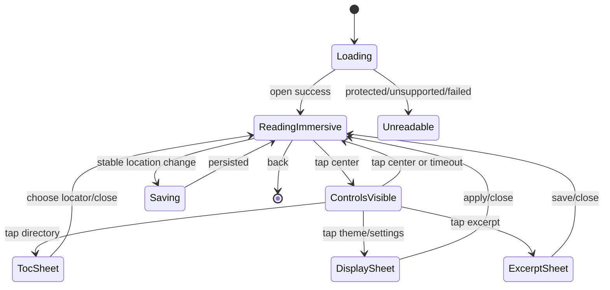

## Context

当前应用是 Expo React Native + SQLite + 应用沙盒文件的本地优先架构。已有 `Media` 实体用于图片和语音，`expo-audio` 已被日记语音播放器使用；「我的」和人物详情是稳定入口；ZIP 备份由 `BackupSnapshot` 和本地文件清单共同完成。

本次功能横跨数据层、文件层、应用状态、导航和备份。音乐播放需要一个跨页面共享的单一播放会话；阅读需要保存原始书籍、解析能力、进度、摘抄和笔记。电子书格式存在容器差异和 DRM 限制，不能将所有扩展名等同于可读。

## Goals / Non-Goals

**Goals:**

- 支持导入、管理和播放本地音乐；曲目与“我的音乐盒/人物喜欢”收藏关系分离。
- 提供单一全局播放会话、队列、播放模式、悬浮播放器和完整播放页。
- 支持导入和管理 PDF、EPUB、无 DRM MOBI、TXT、HTML/HTM 和 FB2；PDF 使用固定版式阅读器，其余可读格式使用重排阅读器。加密 MOBI、AZW/AZW3 和 KFX 保留为受保护/不可读状态，不执行 DRM 绕过。
- 提供阅读进度、摘抄、引用摘抄写观后感、书籍来源写读书笔记。
- 所有结构化数据与原始文件可离线使用、删除和备份恢复。

**Non-Goals:**

- 不实现在线音乐服务、流媒体、账号同步、歌词抓取或音频转码。
- 不实现 DRM 破解；受保护文件或解析失败文件只显示不可阅读状态。
- 不实现 PDF/MOBI/AZW 的跨平台完全一致排版承诺；阅读器以适配器能力为准。
- 不把书摘或音乐内容自动发送到网络或公开社区。
- 不新增一级导航 Tab；入口只从「我的」和人物详情进入。

## Decisions

### 1. 统一媒体与业务实体分层

新增 `MusicTrack`、`MusicCollectionEntry`、`Book`、`BookExcerpt`、`ReadingNote`，原始文件仍通过独立的 `Media`/`DocumentAsset` 文件记录保存。业务实体只保存稳定 ID、展示信息、关系和状态，不把二进制塞进 SQLite。

音乐曲目字段包含：标题、艺术家、专辑、时长、媒体文件 ID、创建/更新时间。`MusicCollectionEntry` 独立保存曲目 ID、收藏目标类型（self/person）、目标 ID 与创建时间；同一曲目可以同时出现在我的音乐盒和多个人物的喜欢列表。书籍字段包含：标题、作者、封面媒体 ID、原始文件媒体 ID、扩展名/格式、解析状态、文件大小、阅读进度和时间戳。

### 2. 音乐采用单例播放控制器

在根布局下挂载 `MusicPlayerProvider`，内部只持有一个 `expo-audio` player 和 `MusicPlaybackState`。状态包含当前曲目 ID、队列曲目 ID、队列来源、索引、播放/暂停、当前位置、总时长、模式（列表循环/随机/单曲循环）、随机周期和错误状态；展示数据始终从当前曲库按 ID 派生，不保存可过期的曲目对象快照。

- 「我的」音乐盒和人物喜欢的音乐都引用同一曲库；添加或移除喜欢只修改收藏关系，不复制或删除曲目文件。
- 播放来源变化时生成去重的队列 ID；队列变化不打断仍然有效的当前曲目，当前曲目被全局删除时安全切换到下一项或停止。
- 下一曲决策由纯函数完成，随机模式使用不重复洗牌队列，单曲循环只重播当前项。
- 悬浮播放器使用绝对定位层，拖动位置持久化到本地偏好并限制在安全区域；点击进入播放页后隐藏悬浮播放器，离开详情页且播放会话仍存在时恢复显示。
- 关闭只清空当前全局播放会话，不删除曲库文件。

选择单例控制器而不是每个页面各自创建播放器，是为了避免音频重叠、路由切换丢失状态和重复申请音频会话。

### 2.1 音乐交互分为曲库、详情和队列三层

参考 QQ 音乐公开页面呈现的“我的音乐 / 播放全部 / 持续播放器”信息架构，仅借鉴成熟交互层级，不复制品牌视觉、文案或素材。移动端保持「仍在」现有主题与组件语言。

- 音乐盒是曲库管理页：展示库概览、播放全部/随机播放、搜索和歌曲列表；歌曲行点击播放，更多按钮承载编辑与删除。
- 完整播放页是当前会话详情：只展示当前曲目、进度和核心控制，不把来源筛选与长列表混入主体。
- 播放队列是底部抽屉：集中承载来源切换、当前队列和选曲；从完整播放页或悬浮播放器进入。
- 从完整播放页返回仅最小化会话；关闭会话保留在悬浮播放器，避免“返回、关闭页面、停止音乐”三个概念混用。

### 3. 音频导入限制

使用 `expo-document-picker` 复制到应用沙盒，按扩展名和 MIME 校验常见音频格式（至少 mp3、m4a、aac、wav、flac、ogg）；不依赖外部 URI 长期有效。导入时默认使用文件名作为标题，用户可编辑元数据。播放能力以设备原生解码器为准，解码失败显示可操作错误。

### 3.1 加密音乐在导入阶段解锁

音乐导入 SHALL 采用“探测 -> 解锁 -> 校验 -> 入库”的事务流程。应用只允许把解锁后能被支持的音频格式识别器确认的文件写入 `media/` 和 SQLite；原始加密文件和失败输出只能存在于临时目录，流程结束时清理。

目标平台和格式首版固定为：网易云 `.ncm`；QQ 音乐 `.qmc0/.qmc2/.qmc3/.qmc4/.qmc6/.qmc8/.qmcflac/.qmcogg/.mgg/.mgg1/.mggl/.mflac/.mflac0/.mflach` 中内嵌媒体密钥或使用传统静态密钥的变体；酷狗 `.kgm/.kgma`。QQ 音乐新版 `musicex`、`STag` 等设备绑定容器缺少原下载设备密钥时必须拒绝；`.kgg` 需要额外密钥数据库，同样拒绝并明确提示，不伪装成已支持。移动应用不能跨应用沙箱读取 QQ 音乐或酷狗的私有密钥数据库。输入扩展名只用于候选路由，最终格式以容器标记、文件头和解码结果为准。

解码核心采用独立 Rust crate，通过本地 Expo 原生模块桥接到 iOS/Android；不把 Python、Docker、Selenium 或 WebView 作为运行时依赖。候选实现 `arcana6264/unlock_music/decoder` 的公开协议是字节输入、字节输出并可返回元数据/封面，覆盖上述三类平台；正式接入前需要固定依赖版本、补齐边界检查、保留 MIT 许可声明，并将核心封装为只暴露 `unlock(input, output)` 的最小 API。原始项目 `old6ix/auto-unlock-music` 仅作为格式覆盖和行为参考，不能直接嵌入移动端。

首版解锁结果不做强制转码：解密后是 MP3 就保存 `.mp3`，是 FLAC 就保存 `.flac`，其他结果只有在 `expo-audio` 的已验证支持矩阵内才允许入库。不得把有损音频转成 FLAC，也不得用改扩展名代替格式转换。

模块边界如下：

```text
DocumentPicker
  -> MusicImportCoordinator (JS)
  -> StillAliveMusicUnlocker (Expo native module)
  -> Rust decoder core
  -> output magic/header validation
  -> metadata/cover mapping
  -> checksum + atomic move
  -> SQLite transaction + MusicTrack
```

原生模块 SHALL 使用临时输出文件和流式/分块处理；不得把整首音乐通过 JS bridge 往返。解锁结果需返回实际扩展名、MIME、字节数、标题/艺术家/专辑（若容器提供）和可选封面。`MusicImportCoordinator` 在数据库事务提交成功前不得暴露曲目；任一步失败都删除输入副本、输出副本和未完成记录。

安全和发布边界：只处理用户已获得并从本地选择器提供的文件；不实现在线下载、账号登录、密钥服务或绕过服务器授权。发布前必须复核三方代码许可证、Apple/Google 的加密与 DRM 相关政策，以及 `ITSAppUsesNonExemptEncryption` 声明。

### 3.1 书籍批量导入与排重

书架同时提供系统文件选择器多选和目录选择。目录导入递归扫描子目录，忽略不支持的扩展名；所有原文件仍在创建业务记录前复制到应用沙盒。排重使用复制后文件的 checksum，对比已有书籍文件与当前批次；重复副本立即删除，不写入媒体和书籍记录。

### 4. 书籍阅读采用双内核格式适配器

定义 `BookReaderAdapter` 接口：探测能力、打开文档、取得目录、渲染正文/页面、翻页或滚动、读取选区、应用阅读偏好、返回稳定定位并保存位置。阅读页只依赖接口，不依赖扩展名假设可读。

经浏览器调研（2026-08-14）形成以下选择：

调研依据：[`epubjs-react-native`](https://github.com/victorsoares96/epubjs-react-native)、[`@epubjs-react-native/core`](https://www.npmjs.com/package/@epubjs-react-native/core)、[`react-native-pdf`](https://github.com/wonday/react-native-pdf)、[`expo-pdf`](https://github.com/kishannareshpal/expo-pdf)、[`react-native-readium`](https://github.com/5-stones/react-native-readium)、[`Readium Mobile`](https://readium.org/mobile/)。仓库正文无法由当前浏览器直接打开时，以搜索结果中公开的 README 摘要为依据，最终兼容性仍以本地 development build 和真机结果为准。

| 方案 | 真实资料 | 结论 |
|---|---|---|
| `epubjs-react-native` / `@epubjs-react-native/core` | 搜索结果提供 Expo Installation、`ReaderProvider`、`useReader()`，基于 EPUB.js + WebView | EPUB 首选；先做 RN 0.86/Expo 57 development build spike |
| `react-native-pdf` | 公开 README 搜索结果显示支持 URL/blob/本地文件、缓存、缩放、横竖向；需要 `react-native-blob-util` 和原生链接 | PDF 首选；需要验证新架构和 Expo prebuild |
| `react-native-readium` | Readium Mobile 本体明确面向 Swift/Kotlin，搜索结果显示 RN wrapper 需要 iOS 13+/Android compileSdk 31+，原生集成较重 | 不作为首版依赖；保留为长期原生升级路线 |
| `expo-pdf` | 搜索结果显示是较新的跨平台 PDF viewer，尚不足以作为当前生产基线 | 不选，避免以新库替换现有风险 |
| `@likecoin/epub-ts` | 仅在 lockfile 中存在，未证明提供可直接使用的 RN 阅读表面 | 不直接作为 UI 内核，避免把转码库误当阅读器 |

因此首版采用 EPUB.js/WebView + 原生 PDF renderer，并为 MOBI/FB2/TXT/HTML 增加统一的重排转换适配器。MOBI 和 FB2 通过纯 JS `rebook` 解析器生成可重建的临时 EPUB，TXT/HTML 使用本地安全转换器生成临时 EPUB，再继续复用 EPUB.js 的字号、主题、选区和翻页体验。实际接入时确认 `@epubjs-react-native/expo-file-system@1.1.4` 仍从 Expo 57 根入口调用已移除的旧文件 API；生产实现保留 `@epubjs-react-native/core`，并在项目内提供仅桥接 `expo-file-system/legacy` 的薄适配器，避免打开本地 EPUB 时运行期报错。`react-native-pdf@7.0.5` 和 `react-native-webview@14.0.1` 的 Android library 脚本还会重复声明旧 AGP，项目通过 pnpm patch 移除子模块 buildscript，统一复用 Expo 57 根工程的 AGP/Kotlin 插件。AZW/AZW3 不进入新导入列表；历史记录保留为归档，未来只有在独立 parser spike 通过后才重新开放。原始文件始终保留，转换缓存可重建和删除。

### 4.1.1 适配器接口与能力矩阵

```text
ReaderScreen
  └─ ReaderSessionController
       ├─ ReflowReaderAdapter -> rebook (MOBI/FB2) or local normalizer (TXT/HTML) -> EPUB.js WebView
       ├─ EpubReaderAdapter   -> epubjs-react-native / EPUB.js WebView
       └─ PdfReaderAdapter    -> native PDF renderer
```

```ts
interface BookReaderAdapter {
  open(asset: BookAsset, initialLocator: BookLocator | null): Promise<ReaderDocument>;
  getCapabilities(): ReaderCapabilities;
  getToc(): Promise<ReaderTocItem[]>;
  goTo(locator: BookLocator): Promise<void>;
  next(): Promise<void>;
  previous(): Promise<void>;
  applyPreferences(preferences: ReadingPreferences): Promise<void>;
  onLocationChange(listener: (event: ReaderLocationEvent) => void): () => void;
  onSelection(listener: (selection: ReaderSelection) => void): () => void;
  close(): Promise<void>;
}
```

能力必须显式返回：`reflow`、`toc`、`selection`、`fontSize`、`lineHeight`、`flow`、`pageJump`、`zoom`。UI 根据能力隐藏或降级控制，禁止显示点击后无效的按钮。

### 4.1.2 定位协议

- EPUB：`type=epub-cfi`，保存 CFI range、章节 href、章节标题和全书 progression；locations 缓存用于显示章节进度，不作为唯一真相。
- MOBI/FB2/TXT/HTML：`type=reflow-cfi`，保存转换后重排文档的 CFI、章节 href、章节标题和 progression；转换缓存可重建，不能把缓存路径当作持久来源。
- PDF：`type=pdf-page`，保存当前页码；只有内核可靠返回总页数时才保存 `pageCount` 与 progression。
- 手动摘抄：`type=manual`，保存当前页或章节快照并标记来源为手动录入。
- 内核版本改变导致定位失效时，优先按章节 href/页码恢复，再显示“已恢复到附近位置”，不静默跳到第一页。

### 4.1 阅读交互采用正文、控制层和工具抽屉三层结构

参考番茄小说公开资料中“正文优先、控制按需出现、阅读工具集中在底部”的交互层级，仅借鉴阅读路径，不复制品牌视觉、文案、商业入口或素材。移动端继续使用「仍在」主题与安全区规则。

- 正文阅读面占据主要空间，不与书籍管理、摘抄列表或说明卡片混排。
- 默认状态为沉浸态：顶部/底部控制和工具抽屉均隐藏时，系统状态栏隐藏，阅读背景与正文延伸到包含状态栏和底部手势区域在内的整个窗口。
- 沉浸态右下角显示轻量 HUD，提供 `HH:mm` 时间、实时电量百分比和充电状态；HUD 避让底部手势安全区，点击后恢复阅读控制，不增加全屏手势拦截层。
- 点击正文中部切换控制态；控制态恢复系统状态栏，顶部和底部控制以悬浮层覆盖正文，不参与正文布局。顶部控制位于 `topInset` 之后，底部控制和工具抽屉使用 `bottomInset` 作为最小内边距。
- 控制态顶部显示返回、书名/章节和更多，底部显示上一章/页、真实位置、下一章/页，以及目录、主题、摘抄、设置；打开任一工具抽屉时同样保留系统状态栏和安全区。
- EPUB 点击左右边缘翻页，正文中部只唤起控制层；PDF 保留滚动/缩放/选区手势，恢复入口必须是小型按钮而不是拦截全屏手势层。
- PDF 纵向模式将当前可见页与主动页码跳转分离：滚动回调只记录进度，只有上一页、下一页和页码跳转操作才调用内核定位，避免滚动时吸附到页首。
- 目录抽屉有“目录 / 摘抄 / 笔记”三个页签，设置抽屉独立存在；关闭任一抽屉不得改变阅读定位。
- 设置首版为所有重排格式提供字号、行距、页边距、系统衬线/无衬线、左右翻页/上下滚动和统一四种阅读主题；PDF 只提供主题、缩放和页码跳转。
- 删去下载、评论、分享、听书、自动阅读、在线字体、背景图片、仿真翻页和亮度控制，保持本地阅读器专注。

### 4.1.3 阅读状态机



只允许一个工具抽屉同时打开；进入完整阅读页时不显示音乐悬浮播放器，离开阅读页再按全局会话恢复其他浮层规则。

### 4.1.4 参考图对应的视觉规格

参考图只提取布局关系，不复制番茄小说的品牌资产：

```text
┌─ full-bleed reading surface ──────────────────┐
│  [沉浸态：隐藏系统状态栏]                      │
│                                                │
│              正文阅读面                        │
│       20–28 px 中文正文 / 宽留白               │
│                                                │
│                         23:48 · 82% · 设置      │
└─ content extends behind bottom gesture area ──┘

控制态（悬浮覆盖正文，不挤压阅读布局）：
┌─ status bar / topInset / floating top bar ────┐
│              正文阅读面                        │
├─ floating bottom controls / bottomInset ──────┤
│ 上一页/章       真实定位       下一页/章       │
│ 目录        主题        摘抄        设置        │
└────────────────────────────────────────────────┘
```

- 阅读正文不放卡片、不放浮层广告、不放长列表；正文最大宽度为屏幕宽度减去 20–24 pt 双侧留白。
- 顶部控制高度约 52 pt，底部控制高度约 128 pt；所有按钮最小触控区域 44 × 44 pt。
- 章节标题使用 14–16 pt、弱化颜色；正文默认 19–21 pt、行距 1.7–1.9；设置改变的是重排正文，不改变 PDF。
- 四套主题保持相同结构：纸白 `#F8F8F4`、暖黄 `#EEE3C9`、护眼绿 `#E6F0DC`、夜间 `#151916`；文本与分隔线按主题派生，不直接写死黑白。
- 目录/摘抄/笔记抽屉占屏幕高度 76–88%，顶部圆角不超过 24 pt；章节行使用分隔线和当前章节色条，不使用厚重卡片。
- 设置抽屉使用分组标题、分段控件、步进按钮和色板；不把长说明文字塞进阅读正文。
- 沉浸态隐藏 `StatusBar`；控制层或抽屉出现时恢复状态栏，并使状态栏、控制层和抽屉共享同一主题背景与明暗样式，避免顶部断层。

### 5. 摘抄与笔记引用模型

`BookExcerpt` 保存书籍 ID、摘抄文本、来源定位（页码/章节/CFI 等可选）、定位类型、章节标题快照、选区前后文短摘要、来源方式（selection/manual）、用户备注和创建时间。阅读器长按或选择文本后创建摘抄；PDF 无可靠选区 API 时必须明确走手动录入。

创建观后感/读书笔记时，可以从当前书籍或已有摘抄插入只读引用块；引用保存书籍 ID、摘抄 ID、显示文本和定位快照，即使原书后续不可读，历史笔记仍可展示。笔记正文沿用现有 Markdown Post 模型，通过 `sourceBookId`/`sourceExcerptIds` 元数据关联，而不是复制成新的书籍文件。

引用块必须是编辑器中的只读来源节点，用户正文写在引用块之后；删除原书后只移除“打开原书”操作，不删除快照。

### 6. 本地备份与删除

扩展 `BackupSnapshot` 和 ZIP 清单：书籍、曲目、摘抄、阅读笔记引用、播放模式偏好进入 `data.json`；音乐文件、书籍原文件、封面和阅读缓存按稳定相对路径进入 ZIP。恢复前校验格式、路径、引用和文件 checksum；遇到不支持格式仍恢复元数据与原文件，不强制解析。

删除书籍时默认保留引用它的笔记/摘抄快照，删除原始文件和阅读缓存；全局删除曲目时先删除全部收藏关系、从播放队列移除并清理未被其他实体引用的音频文件。删除人物时只删除该人物的喜欢关系，不删除曲目文件和其他收藏关系。

### 7. 阅读观后感复用现有写作入口

不新增独立“观后感编辑器”。从书籍详情、摘抄详情或阅读页进入现有编辑器，预填引用块和书籍来源；用户仍可编辑 Markdown、添加图片、语音和人物关联。这样可以复用草稿、保存、历史时间线和备份链路。

阅读来源写作不依赖当日打卡：编辑器在验证书籍存在、书摘归属正确后直接放行。普通日记入口仍保留原打卡守卫；无效来源参数必须拒绝，不得作为绕过守卫的布尔标记。

## Risks / Trade-offs

- **[格式兼容]** MOBI 生态复杂且可能带 DRM → 仅承诺无 DRM MOBI，导入时解析探测，失败或加密状态可见并保留原文件；AZW/AZW3 不纳入新导入列表。
- **[EPUB 依赖兼容]** `epubjs-react-native` 的 Expo 安装路径和 RN 0.86 新架构支持仍需真实双端 development build 验证；当前实现已接入书架主流程，验证未通过时应将该格式回退为保留原文件的不可读状态。
- **[PDF 依赖兼容]** `react-native-pdf` 需要原生模块与文件访问依赖；当前已替换移动端 DOM `<embed>`，仍需在 iOS/Android 真机验证大文件、缩放、页码和选区。
- **[依赖体积]** 电子书解析库可能增大 iOS/Android 包体 → 按格式拆分适配器，避免把解析库放入不需要的入口；构建后检查 bundle。
- **[后台播放]** Expo 音频会话和系统后台策略存在平台差异 → 播放控制器集中配置，首版验收覆盖锁屏/后台；不承诺系统通知栏完整控制器。
- **[大文件]** 书籍和音乐可能占用大量空间 → 导入前显示文件大小，限制单文件和总量，导出/删除前显示影响范围。
- **[编辑器兼容]** 现有 Post 模型没有书籍来源字段 → 使用可选来源元数据并保持旧 Post 读取兼容，不改变已有日记排序语义。

## Migration Plan

1. SQLite 增加新表和可选设置字段，旧数据库通过迁移创建空集合，不影响现有数据。
2. 扩展备份 schema 版本和快照迁移；缺少新字段的旧备份按空数组处理。
3. 根布局挂载播放器 Provider；无音乐/书籍数据时不显示入口卡片之外的浮层。
4. 导入失败只清理临时文件，不修改已有曲库或书架。
5. 若 EPUB 或 PDF 依赖在真实 development build 中无法稳定运行，保留书架和原始文件，并将该格式回退为 `unsupported`；不把 DOM `<embed>` 作为移动端完整阅读器。

## 已决策问题

- 首版可读格式为 PDF、EPUB、无 DRM MOBI、TXT、HTML/HTM 和 FB2；AZW/AZW3 不纳入新导入列表，既有文件只作为归档保留。
- 阅读观后感和读书笔记继续作为普通 Post 进入空间时间线，同时保留书籍和摘抄来源元数据。
- EPUB/PDF 已分别接入可重排与原生固定版式阅读内核；在 RN 0.86/Expo 57 双端真机验收通过前，保持发布门禁，不扩大可读格式范围。
